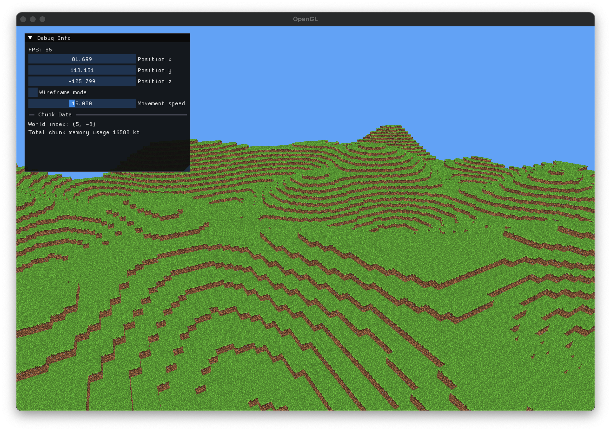

# Recreation of Minecraft

## Todo

- [x] Loading multiple chunks
- [x] Different block types
- [x] Sort chunks by distance to player
- [x] Water
- [ ] Sort faces in transparent mesh
- [x] Separate transparent blocks into different mesh
- [x] Trees
- [ ] Good terrain generation
- [ ] Optimize VRAM usage
- [ ] Placing/breaking blocks
- [x] Ambient occlusion
- [ ] Refactor code

## Progress Screenshots

