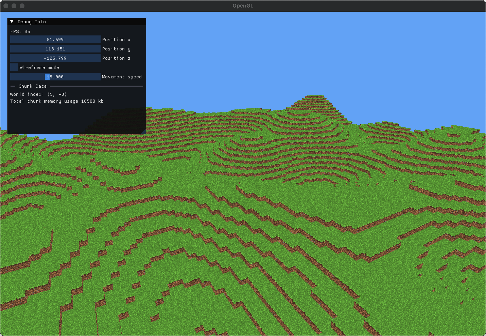

# Minecraft-Style Voxel Engine
A custom voxel rendering engine inspired by Minecraft, built from scratch in C++ using OpenGL


## Features
- Infinite procedural terrain with chunk-based loading/unloading
- Placing and breaking blocks
- Transparent glass and water rendering
- Ambient occlusion lighting
- Custom water shader with vertex wave displacement
- Debug overlay

## Tech Used
- C++20
- OpenGL (GLFW, GLEW)
- GLSL for shaders
- GLM for math
- ImGui for debugging tools

## Installation
1. Clone the repository
```zsh
git clone https://github.com/0tomdev/voxel-engine.git
cd voxel-engine
```
2. Compile and run
```bash
make run
```

## Development Screenshots

### Initial Terrain Prototype


### Improved Graphics and Terrain


## References
1. Ambient occlusion: https://0fps.net/2013/07/03/ambient-occlusion-for-minecraft-like-worlds/
1. Meshing: https://0fps.net/2012/06/30/meshing-in-a-minecraft-game/
1. OpenGL YouTube series: https://www.youtube.com/playlist?list=PLlrATfBNZ98foTJPJ_Ev03o2oq3-GGOS2
